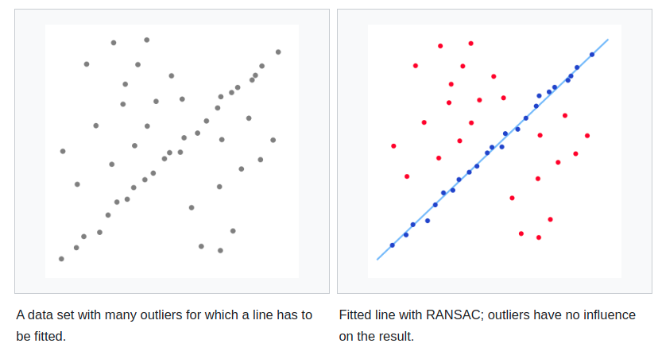

# myRansac

## Introduction

Refer to the RANSAC algorithm demo in [wiki](https://en.wikipedia.org/wiki/Random_sample_consensus)。A simple example is [fitting a line](https://en.wikipedia.org/wiki/Regression_analysis) in two dimensions to a set of observations. Assuming that this set contains both inliers, i.e., points which approximately can be fitted to a line, and outliers, points which cannot be fitted to this line, a [simple least squares method](https://en.wikipedia.org/wiki/Ordinary_least_squares) for line fitting will generally produce a line with a bad fit to the data including inliers and outliers. The reason is that it is optimally fitted to all points, including the outliers. RANSAC, on the other hand, attempts to exclude the outliers and find a linear model that only uses the inliers in its calculation. This is done by fitting linear models to several random samplings of the data and returning the model that has the best fit to a subset of the data. Since the inliers tend to be more linearly related than a random mixture of inliers and outliers, a random subset that consists entirely of inliers will have the best model fit. In practice, there is no guarantee that a subset of inliers will be randomly sampled, and the probability of the algorithm succeeding depends on the proportion of inliers in the data as well as the choice of several algorithm parameters.



## Overview

The RANSAC algorithm is essentially composed of two steps that are iteratively repeated:

1. In the first step, a sample subset containing minimal data items is randomly selected from the input dataset. A fitting model and the corresponding model parameters are computed using only the elements of this sample subset. The cardinality of the sample subset is the smallest sufficient to determine the model parameters.
2. In the second step, the algorithm checks which elements of the entire dataset are consistent with the model instantiated by the estimated model parameters obtained from the first step. A data element will be considered as an outlier if it does not fit the fitting model instantiated by the set of estimated model parameters within some error threshold that defines the maximum deviation attributable to the effect of noise.

RANSAC achieves its goal by repeating the following steps:

1. Select a random subset of the original data. Call this subset the *hypothetical inliers*.
2. A model is fitted to the set of hypothetical inliers.
3. All other data are then tested against the fitted model. Those points that fit the estimated model well, according to some model-specific [loss function](https://en.wikipedia.org/wiki/Loss_function), are considered as part of the *consensus set*.
4. The estimated model is reasonably good if sufficiently many points have been classified as part of the consensus set.
5. Afterwards, the model may be improved by reestimating it using all members of the consensus set.

This procedure is repeated a fixed number of times, each time producing either a model which is rejected because too few points are part of the consensus set, or a refined model together with a corresponding consensus set size. In the latter case, we keep the refined model if its consensus set is larger than the previously saved model.

## Algorithm

The generic RANSAC algorithm works as follows:

```
Given:
    data – A set of observations.
    model – A model to explain observed data points.
    n – Minimum number of data points required to estimate model parameters.
    k – Maximum number of iterations allowed in the algorithm.
    t – Threshold value to determine data points that are fit well by model.
    d – Number of close data points required to assert that a model fits well to data.

Return:
    bestFit – model parameters which best fit the data (or null if no good model is found)

iterations = 0
bestFit = null
bestErr = something really large

while iterations < k do
    maybeInliers := n randomly selected values from data
    maybeModel := model parameters fitted to maybeInliers
    alsoInliers := empty set
    for every point in data not in maybeInliers do
        if point fits maybeModel with an error smaller than t
             add point to alsoInliers
        end if
    end for
    if the number of elements in alsoInliers is > d then
        // This implies that we may have found a good model
        // now test how good it is.
        betterModel := model parameters fitted to all points in maybeInliers and alsoInliers
        thisErr := a measure of how well betterModel fits these points
        if thisErr < bestErr then
            bestFit := betterModel
            bestErr := thisErr
        end if
    end if
    increment iterations
end while

Least squares estimation based on inliers

return bestFit
```


Result of running the `RANSAC` implementation. The orange line shows the least squares parameters found by the iterative approach, which successfully ignores the outlier points.

## Build

```shell
git clone https://github.com/GDUT-Kyle/myRansac
mkdir build && cd build
cmake ..
make
./main
```

